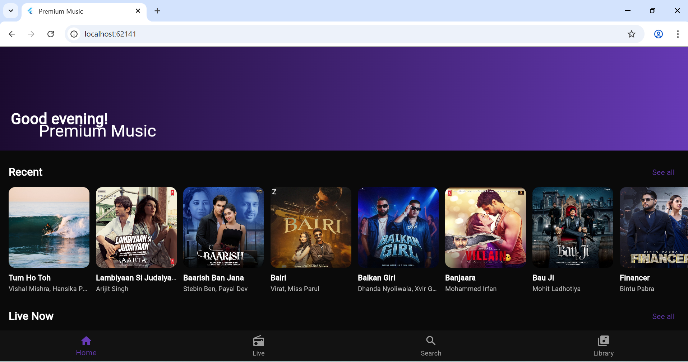
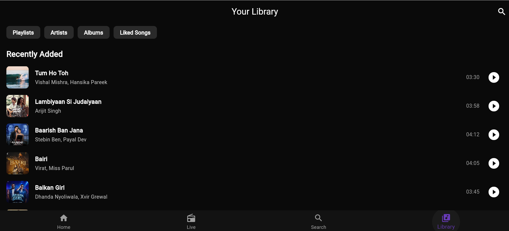
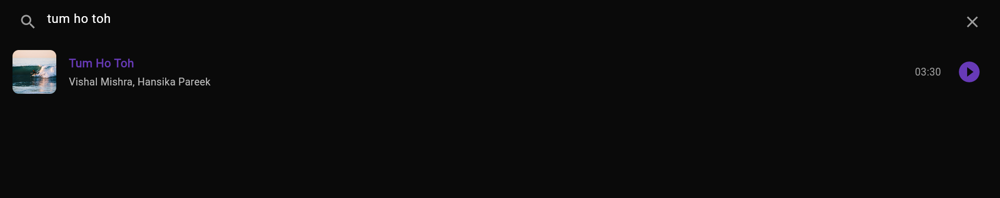

# 🎵 Music App v2.0.0

[](https://flutter.dev) [](https://opensource.org/licenses/MIT)

A cross-platform **Flutter music player** for Android, iOS, web, and desktop. Features local audio playback, playlists, downloads, album art fetching, search/library/live streams, and Material 3 design with dark theme.

## ✨ Features
- **Audio Playback**: Local & streaming with `just_audio` + `audio_service` (background play, notifications)
- **Device Music**: Scan device library (`on_audio_query`)
- **Queue & Controls**: Playlist queue, skip, loop, shuffle
- **Downloads**: Offline support (`dio`, `path_provider`)
- **Album Art**: iTunes API covers + palette extraction (`palette_generator`)
- **UI/UX**: Material 3 dark theme, shimmer loading, Lottie animations
- **Screens**: Home, Library, Search, Now Playing (with mini-player bar), Live streams
- **State Management**: Riverpod providers
- **Storage**: Hive for offline data
- **Assets**: Sample audio/images included for testing

## 📱 Screenshots
*(Add screenshots to `screenshots/` folder)*






## 🛠️ Installation

### Prerequisites
- Flutter SDK >=3.11.5 (`flutter doctor`)
- Android: Enable USB debugging, permissions for storage/audio
- iOS: Xcode, simulator provisioning

### Quick Start
```bash
cd c:/Users/Sahil.yadav/Desktop/music_app
flutter pub get
flutter run
```

For web: `flutter run -d chrome`

## 🚀 Usage
- **Home**: Featured songs/live events
- **Library**: Downloaded/device songs, playlists
- **Search**: Find tracks
- **Now Playing**: Full controls, background persistent
- Test with bundled assets/audio/

## 🏗️ Architecture
```
lib/
├── models/     (Song, LiveEvent)
├── screens/    (Home, Library, Search, NowPlaying)
├── services/   (AudioHandler/Player, Download, Image, MockAPI)
├── widgets/    (SongTile, SongImage, NowPlayingBar)
└── utils/
```
- **Riverpod** for state (providers)
- **Services** for business logic
- **Hive** for local persistence

## 📋 TODO
See [TODO.md](TODO.md) for progress and next steps.

## 🤝 Contributing
PRs welcome! Focus areas: real APIs, device integration, UI polish.

## 📄 License
MIT - See [LICENSE](LICENSE) (create if needed)

**Built with ❤️ using Flutter**

